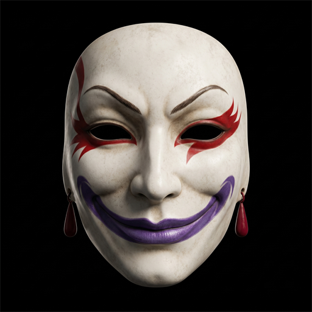

<p align="center">
  
</p>

# Mask of Kefka

A [Dalamud](https://dalamud.dev) plugin for FFXIV that creates a **second window with a clean image of the game**: no ImGui, no plugin overlays, no Dalamud at all. Capture that window in OBS and stream with all your quality-of-life plugins without showing them. In short: a **streamer mode** (stream mode) for FFXIV.

Inspired by [MaskedCarnivale (ProjectMimer)](https://github.com/ProjectMimer/MaskedCarnivale), rewritten from scratch for current Dalamud.

## Disclaimer

**This plugin was not made to deceive anyone. It was made to protect your account. Use it responsibly.**

Square Enix prohibits all third-party tools. Showing them on stream creates a permanent, public record that can be acted upon. This plugin exists so that streamers who already use quality-of-life plugins do not expose themselves on video. It does not make using third-party tools allowed, it does not hide them from Square Enix, and it does not reduce any risk other than the visual one. What you do with your account remains your responsibility.

## Features

- Clean mirror of the game (scene + game UI) in a separate window, free of any Dalamud overlay.
- Optional no-UI mode: shows only the scene, for immersive recordings.
- Borderless mode: hides the title bar for a clean capture. Drag the window from anywhere inside it and resize from the edges.
- Output rate limiter: render 1 frame every N to cut the GPU cost of the output.

## What it does NOT hide (read this before streaming)

The plugin hides **ImGui overlays only**: Dalamud windows, plugin windows, and anything else drawn on top of the game by Dalamud. Everything that is part of the game itself stays visible, including changes made by plugins:

- **Plugins that modify the game content** (Penumbra, Glamourer, Mare and similar): model, texture and animation changes are part of the rendered scene and show up in the output.
- **Plugins that write to the game chat**: chat is game UI. Any plugin message printed there appears on stream.
- **Plugins that modify native game UI** (nameplates, cast bars, party list tweaks and similar): they edit the game's own elements, which the output shows.
- **The Dalamud entry in the game's system menu**: drawn by the game UI. Disable it in the Dalamud settings if needed.

Before going live, open the output window and check what your specific plugin set looks like in it. When in doubt, assume that anything you can see without opening a floating window will be visible on stream.

## Commands

| Command | Effect |
|---|---|
| `/kefka` | Opens the configuration window |
| `/kefka on` / `/kefka off` | Starts/stops the output window |
| `/kefka ui` | Toggles the game UI in the output |

## Capturing in OBS

1. Enable the output window (`/kefka on`).
2. In OBS, add a **Window Capture** source and select the `Mask of Kefka` window.
3. Use the **Windows 10 (1903 and up)** capture method (Windows Graphics Capture).
4. **Minimize the Mask of Kefka window** once the capture is set up (there is a button for it in `/kefka`).

Step 4 matters: while the output window is visible, Windows composes it every frame and the game can lose a significant amount of fps (the game window may also drop out of its optimized fullscreen presentation). Minimized, the cost is virtually zero. On current Windows 11 the capture keeps updating normally while the window is minimized; if your capture freezes instead (older Windows builds), keep the window visible but small and consider the output rate limiter in `/kefka`.

Do not use Game Capture: it hooks the game process and captures the main window, overlays included.

The same applies to Discord screen sharing and similar tools: share the `Mask of Kefka` window, not the game, and minimize it after picking it (do a quick test on your setup first).

Tips:

- To show your cursor on stream, enable the software cursor in the game settings. The hardware cursor does not appear in the capture.
- Enable the borderless option in `/kefka` so the title bar does not show up in the capture.

## Installing

Requirements: [XIVLauncher](https://goatcorp.github.io/) with Dalamud enabled.

1. In game, type `/xlsettings` and open the **Experimental** tab.
2. Under **Custom Plugin Repositories**, paste the URL below into an empty box:

   ```
   https://raw.githubusercontent.com/doomzao/plugins/main/repo.json
   ```

3. Click the **+** button on the right, then the **save** button at the bottom right.
4. Open `/xlplugins`, search for **Mask of Kefka** (or "streamer mode") and install it.

That repository URL covers all my plugins: add it once and future plugins appear in the installer automatically.

### Building from source

Requires the [.NET 10 SDK](https://dotnet.microsoft.com/download/dotnet/10.0).

```powershell
dotnet build -c Release
```

Then, in game:

1. `/xlsettings`, then the **Experimental** tab, then **Dev Plugin Locations**.
2. Add the path `...\mask-of-kefka\MaskOfKefka\bin\Release\MaskOfKefka.dll` and save.
3. `/xlplugins`, then **Dev Tools**, then **Installed Dev Plugins**, and enable Mask of Kefka.

## Known limitations and possible failures

- **HDR**: the output window is SDR. With the game in HDR the colors may look washed out; prefer SDR for streaming.
- **The no-UI mode breaks on game patches.** It depends on a render target index that shifts whenever Square Enix touches the graphics pipeline. It is reconfigurable in the plugin settings without a rebuild, and while the index is invalid the output safely falls back to the with-UI mode. The default with-UI mode does not use any index and keeps working across patches.
- **Game or Dalamud updates can break the plugin entirely** (it stops loading or compiling) until it is updated. This is true for every Dalamud plugin.
- **Hardware cursor is not captured.** Enable the software cursor in the game settings if you want the cursor on stream.
- **Audio is not part of the window.** Capture the game audio in OBS as usual (desktop or application audio); the output window only carries video.
- **A visible output window can cost game fps.** Minimize it while streaming (see Capturing in OBS). On older Windows builds the capture may freeze while minimized; in that case keep the window small and visible instead.
- **OBS Game Capture does not work for this**; it hooks the game and captures the main window, overlays included. Use Window Capture on the output window.
- **Failure behavior**: if rendering fails repeatedly (for example after a video device reset), the plugin logs the error and shuts the output down instead of crashing the game. Reopen it with `/kefka on`.
- This plugin is young and has not been battle-tested across every setup (multi-monitor DPI mixes, HDR, exotic drivers). If something looks wrong, open an issue with your setup details.

## License

[AGPL-3.0-or-later](LICENSE)
